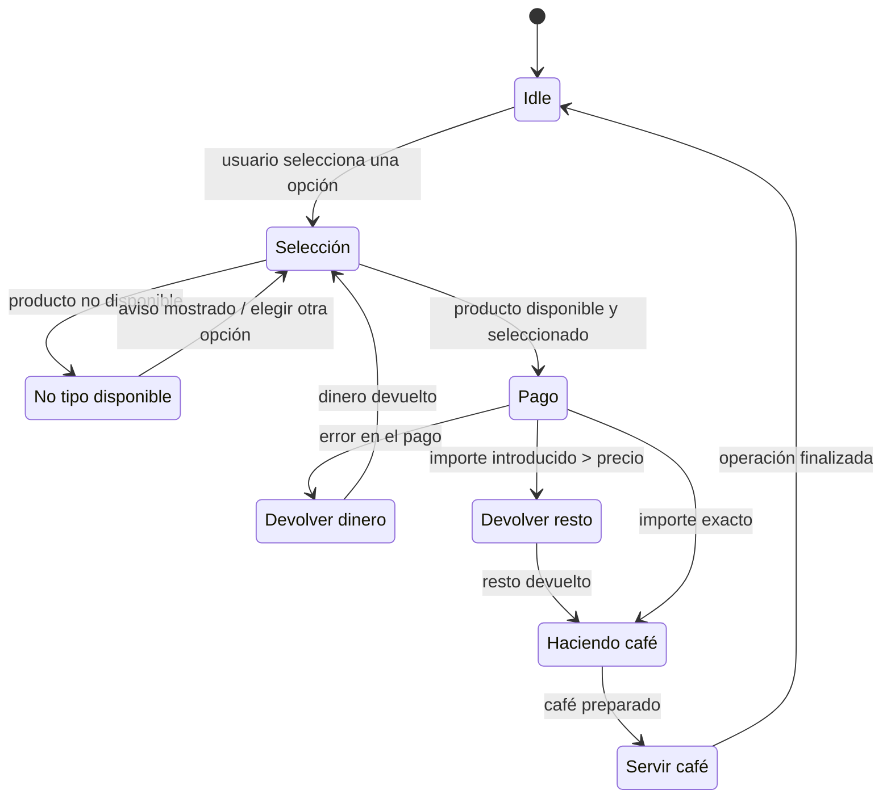

# Diagrama de estados de la máquina de café

El estado inicial de la máquina es `Idle`. El diagrama incluye el flujo
principal y las rutas alternativas según la disponibilidad del producto y el
resultado del pago.

El flujo principal es:

`Idle → Selección → Pago → Haciendo café → Servir café → Idle`

Los flujos alternativos son:

- `Selección → No tipo disponible → Selección`
- `Pago → Devolver dinero → Selección`
- `Pago → Devolver resto → Haciendo café`